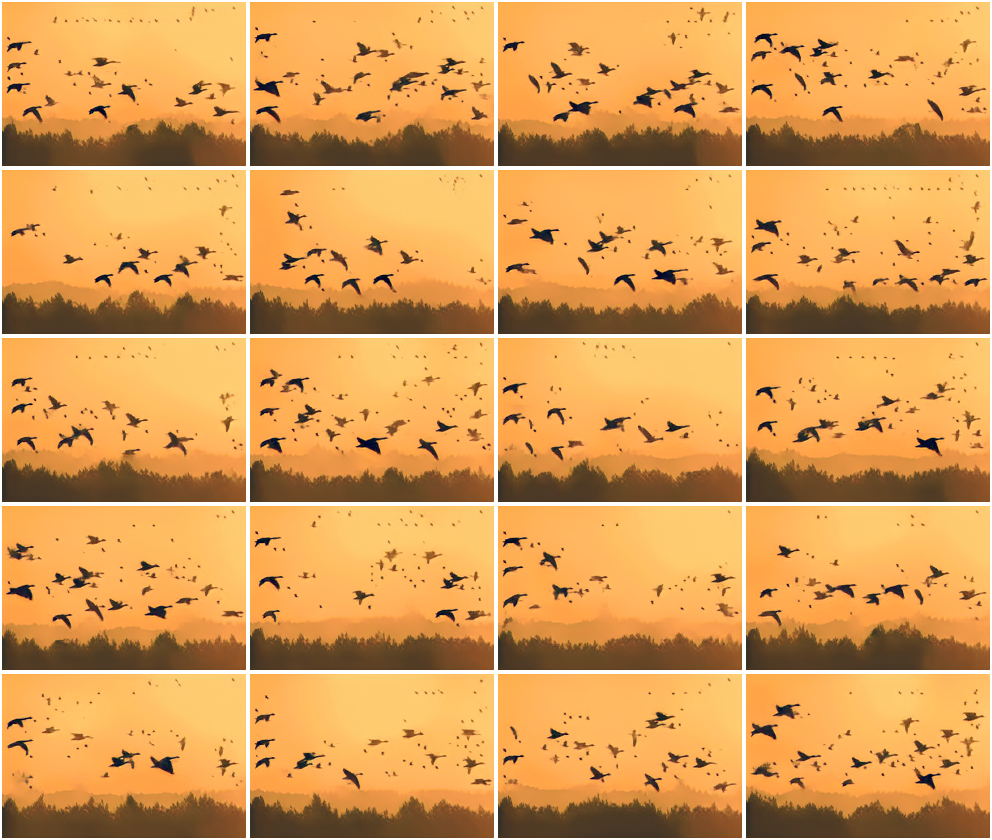
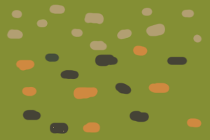
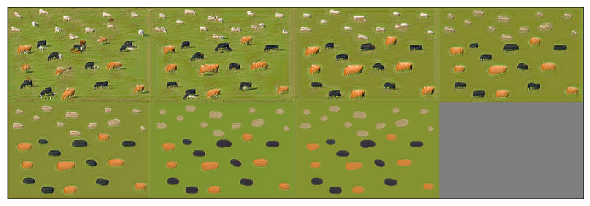
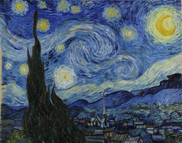
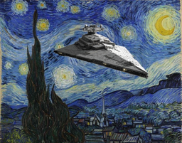
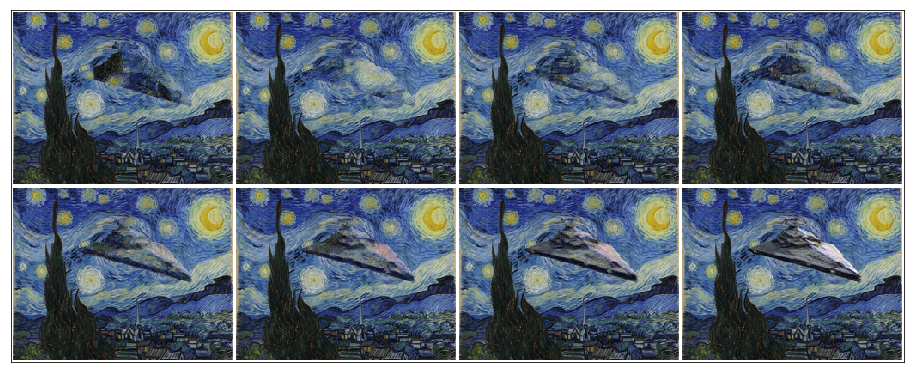
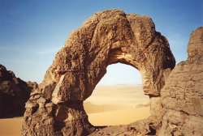
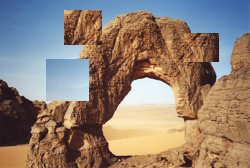
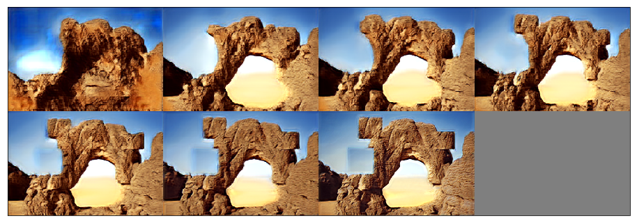

# sinGAN Pytorch Implementation

## Paper

[SinGAN: Learning a Generative Model from a Single Natural Image](https://arxiv.org/abs/1905.01164), ICCV 2019, Best Paper Award


## Getting Started

### Prerequisite
 

### Installation
- Clone this repo:
```bash
git clone https://github.com/bocharm/sinGAN.git
cd sinGAN
```
- Install PyTorch and dependencies from http://pytorch.org   

### Model Training
- Train a model:
```
python main.py --location server
```


## Results of this implementation

#### Random samples
- Train Image


- Model Output (Random Sampled)



#### paint to image
- Train Image 


- Naive Image



- Model Output (image order : from coarsest scale to finest scale)



#### Harmonization
- Train Image 



- Naive Image



- Model Output (image order : from coarsest scale to finest scale)



#### Editing
- Train Image 



- Naive Image



- Model Output (image order : from coarsest scale to finest scale)




## TODO
- Other task in paper - Paint to img, Editing, Harmonization, SR, Animation
- Arbitrary aspect ratio, resolution

## Reference 
[sinGAN](https://github.com/tamarott/SinGAN) (Author Implementation)
