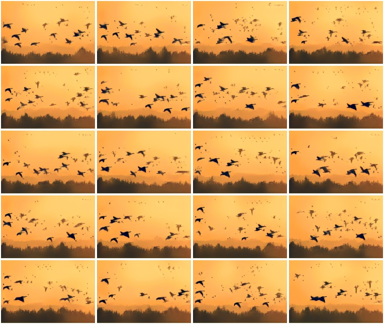

# sinGAN Pytorch Implementation

## Paper

[SinGAN: Learning a Generative Model from a Single Natural Image](https://arxiv.org/abs/1905.01164), ICCV 2019


## Getting Started

### Prerequisite - Very Critical
- This repository has huge dependency on my custom module, [chanye](https://github.com/bocharm/chanye). I highly recommend to `git clone` this repo and add to your `PYTHON PATH`
- Your data should be inside of `get_dataset_path()` methods. [Reference](https://github.com/bocharm/chanye/blob/master/_settings.py)
- `get_dataset_path()` determine the path through `os.environ()` and environment variable is set through `-- location` flag in `main.py`. 

### Installation
- Clone this repo:
```bash
git clone https://github.com/bocharm/sinGAN.git
cd sinGAN
```
- Install PyTorch and dependencies from http://pytorch.org   

### Model Training
- Train a model:
```
python main.py --location server
```

### Datasets


## Results of this implementation

##### random_sample from *single* image



## Reference 
[sinGAN](https://github.com/tamarott/SinGAN) (Author Implementation)
