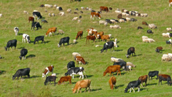
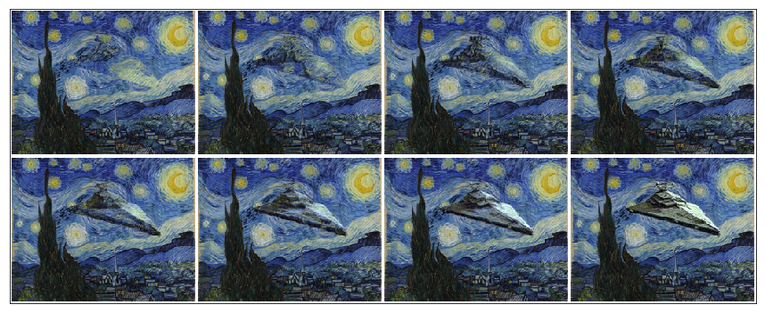

# sinGAN Pytorch Implementation

## Paper

[SinGAN: Learning a Generative Model from a Single Natural Image](https://arxiv.org/abs/1905.01164), ICCV 2019, Best Paper Award


## Getting Started

### Prerequisite
 

### Installation
- Clone this repo:
```bash
git clone https://github.com/bocharm/sinGAN.git
cd sinGAN
```
- Install PyTorch and dependencies from http://pytorch.org   

### Model Training
Most of parameters and settings for model is determined from config file. Therefore you should edit config file according to your preference and give a path for your config file as parameter of python script. Default setting is `./config/random_sample.yaml`.

Importantly, you should be careful about the path of input image and which mode(application, e.g. random_sample, editing..) you wanna train and test. Once model is trained for specific config file, inference after train is possible with only desired config file, because the path for saved model is also inside of config file. However, if you edit the config file correctly, inference is possible  

- Train a model (random_sample for `assets/Input/Image/birds.png`) :

``` 
python train.py
```

- Train a model - paint2image, editing, harmonization ..:

For these application, you should declare `path of naive image` inside of config file. 
```
python train.py --config ./config/paint2image.yaml
```

- Train a model - super_resolution:

For super resolution, you should declare `sr_factor`  inside of config file.
```
python train.py --config ./config/SR.yaml
```

- Test a model:

_parameter_ `--mode` determine the types of application   
```
python test.py --config ./config/editing.yaml --mode editing
```


## Results of this implementation

#### Random samples
- Train Image


- Model Output (Random Sampled)


#### paint to image
- Train Image 



- Naive Image


- Model Output (image order : from coarsest scale to finest scale)


#### Harmonization
- Train Image 


- Naive Image


- Model Output (image order : from coarsest scale to finest scale)



#### Editing
- Train Image 


- Naive Image


- Model Output (image order : from coarsest scale to finest scale)


## TODO
- inference for arbitrary aspect ratio, resolution

## Reference 
[sinGAN](https://github.com/tamarott/SinGAN) (Author Implementation)
